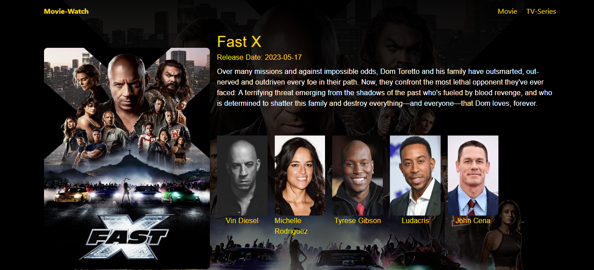

# Movie-TV Fevo

Welcome to Movie-TV Fevo! This website, built with React and Vite, is designed to provide information about movies and TV shows. You can explore a wide range of content, including details about movies, TV shows, actors, and more.

## Features

- Browse popular movies and TV shows.
- Get detailed information about movies, including plot summaries, release dates, ratings, and more.
- Discover information about TV shows, including episode guides, seasons, and cast members.
- Search for your favorite movies and TV shows using the search functionality.
- View high-quality images and posters related to movies and TV shows.

## Live Demo

Check out the live demo of Movie-TV Fevo: [https://movie-tv-fevo.netlify.app/](https://movie-tv-fevo.netlify.app/)

## Screenshots

Here are some screenshots of the Movie-TV Fevo website:

*The home page displays popular movies and TV shows.*

*Detailed information about a movie, including plot summary, release date, and rating.*

*Detailed information about a TV show, including episode guide and cast members.*

## Technologies Used

- React
- Vite
- Swiper
- TanStack (Formik, Yup)
- React Intersection Observer
- Material-UI (Mui)
- Framer Motion
- React Router DOM
- Axios

## Setup and Installation

1. Clone the repository: `git clone https://github.com/your-username/movie-tv-fevo.git`
2. Navigate to the project directory: `cd movie-tv-fevo`
3. Install dependencies: `yarn install`
4. Start the development server: `yarn dev`
5. Open `http://localhost:3000` in your preferred web browser.

## Contributions

Contributions to Movie-TV Fevo are welcome! If you find any bugs or have suggestions for new features, please open an issue or submit a pull request.

## License

This project is licensed under the [MIT License](LICENSE).
